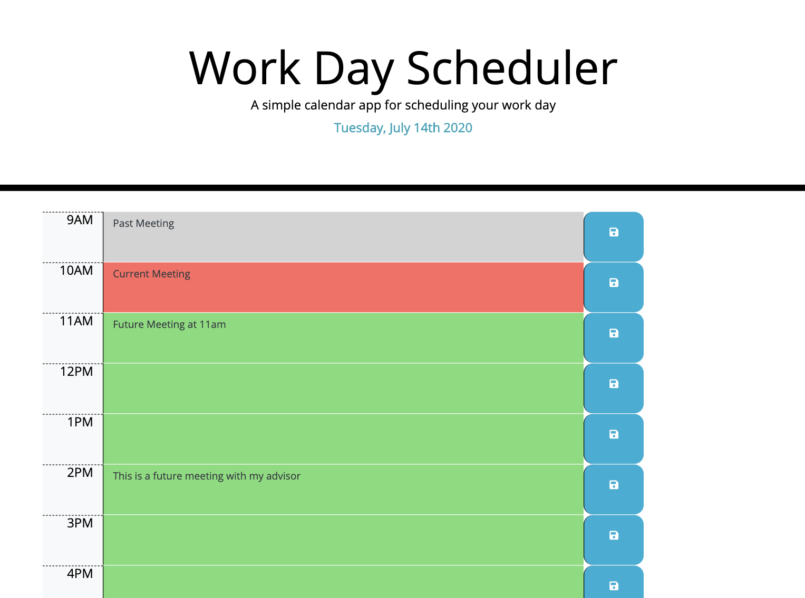

# Day Planner

# Description

Simple calendar application that allows the user to save events for each hour of the day from 9AM to 5 PM.

## Deployed Website : 
[Day Planner](https://gaurikhandke.github.io/Gauri-day-planner/)

# Table of Contents
* [Demo](#demo)
* [Technology](#technology)
* [Features](#features)
* [License](#license)
* [Contribution](#contribution)
* [Questions](#questions)

# Motivation

* Employee with busy schedule should be able to add important events to a daily planner to manage time effectively.
* Poor time management can result in missed meetings and deadlines or create the appearance of unprofessionalism. A daily planner allows employees to see their day at a glance, schedule time effectively, and improve productivity.

# Demo : 

# Application Preview : 

# Technology: 

#### [jQuery](https://jquery.com/) : 
* jQuery is a fast, small, and feature-rich JavaScript library. It makes things like HTML document traversal and manipulation, event handling, animation, and Ajax much simpler with an easy-to-use API that works across a multitude of browsers.

#### [Javascript](https://developer.mozilla.org/en-US/docs/Web/JavaScript) : 
* JavaScript is a cross-platform, object-oriented scripting language used to make webpages interactive.
* JavaScript(JS) is a lightweight, interpreted, or just-in-time compiled programming language with first-class functions. 
* With the HTML DOM, JavaScript can access and change all the elements of an HTML document.

#### [Bootstrap](https://getbootstrap.com/) : 

* Bootstrap is a free and open-source CSS framework directed at responsive, mobile-first front-end web development. It contains CSS and (optionally) JavaScript-based design templates for typography, forms, buttons, navigation, and other interface components.

#### [Moment.js](https://momentjs.com/) : 

* JavaScript Library to work with date and time. Parse, validate, manipulate, and display dates and times in JavaScript.

# Features : 

1. Current day is displyed at the top of the calender.

2. The application displays timeblocks for standard business hours (9 a.m. to 5 p.m.), user can save events at perticular hour.

3. Each timeblock contains an input field and save button.

4. Clicking a timeblock's "Save" button stores the input text in `localStorage`, allowing the text to persist when the application is refreshed.

4. Each hour is color coded to reflect whether the time slot is in the past, present or future. This changes depending on the time of the day.

# License

This project is licensed under MIT License.

# Contribution

Please let me know how I can improve this project. Issues and pull requests are always welcome.

# Questions :
* If you have any questions about the repo, please submit issue [here](https://github.com/GauriKhandke/Gauri-day-planner/issues/new) or [email](mailto:khandkegauri@gmail.com) me.

